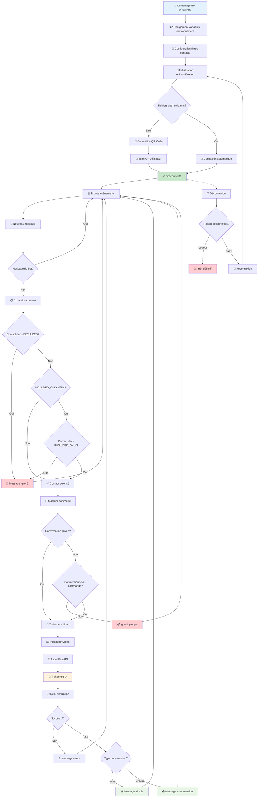
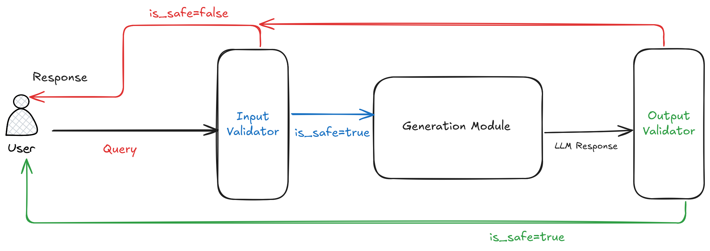

# WhatsApp AI Chatbot - Baileys & FastAPI

> Un chatbot WhatsApp intelligent utilisant Baileys pour la connectivité et FastAPI avec DSPy pour le traitement par IA.

## Comment ça fonctionne

Ce projet permet de créer un assistant IA sur WhatsApp qui peut :
- Répondre intelligemment aux messages privés et en groupe
- Effectuer des recherches web en temps réel
- Se souvenir des conversations précédentes
- Filtrer les contacts autorisés à interagir avec le bot


L'architecture est simple : les messages WhatsApp passent par un bot Node.js qui les transmet à une API Python FastAPI. L'IA (DSPy + Mistral) génère les réponses en utilisant l'historique des conversations et peut effectuer des recherches web automatiques. Pour des raisons de sécurité ou autre ( prompt injection, safety  etc), un filtre basique est placé avant et après le module de génération 

## Diagramme


### Aperçu visuel du fonctionnement des  filtres



## Fonctionnalités

### IA Conversationnelle
- Moteur DSPy avec Mistral AI (configurable)
- Recherche web intégrée (Wikipedia + recherche générale)
- Historique de conversation persistant (SQLite)
- Validation des entrées/sorties par IA

### Gestion des conversations
- **Messages privés** : Répond automatiquement
- **Groupes** : Répond uniquement quand mentionné avec `@` ou aux commandes `/`
- **Filtrage de contacts** : Listes d'inclusion/exclusion configurables

### Contrôle d'accès
- **INCLUDED_ONLY** : Liste des numéros autorisés uniquement
- **EXCLUDED** : Liste des numéros à bloquer complètement
- Support des formats internationaux avec normalisation automatique

## Structure du projet

```
whatsapp-simple-bot/
├── app.js                    # Bot WhatsApp principal (Node.js)
├── .env                      # Configuration filtrage contacts
├── api/                      # API FastAPI (Python)
│   ├── main.py              # Serveur FastAPI + logique IA
│   ├── chat_history.db      # Base de données SQLite
│   ├── requirements.txt     # Dépendances Python
│   └── .env                 # Variables d'environnement IA
├── auth_info_baileys/       # Données d'authentification WhatsApp
└── package.json             # Dépendances Node.js
```

## Installation

### Prérequis
- Node.js 
- Python 3
- Clé API Mistral (ou autre provider LLM)

### Setup
```bash
git clone <repo-url>
cd whatsapp-simple-bot

# Installation Node.js
npm install

# Installation Python
cd api
pip install -r requirements.txt
```

### Configuration

**Fichier `api/.env` :**
```env
MISTRAL_API_KEY=votre_cle_mistral_api
```

**Fichier `.env` (filtrage contacts) :**

Cette configuration permet de définir à qui le bot doit repondre ou non 
```env
# Autoriser seulement ces numéros (optionnel)
INCLUDED_ONLY=+33123456789,+33987654321

# Bloquer ces numéros (optionnel)  
EXCLUDED=+33111111111,+33222222222
```

## Démarrage

1. **Lancer l'API FastAPI**
```bash
cd api
python main.py
```

2. **Lancer le bot WhatsApp**
```bash
node app.js
```

3. **Authentification WhatsApp**
   - Scanner le QR code affiché
   - WhatsApp → Paramètres → Appareils liés → Lier un appareil

## Utilisation

### Messages privés
Le bot répond automatiquement à tous les messages privés sauf ceux qui provenant de contacts que vous définissez vous-meme

### Messages de groupe
Le bot répond uniquement quand :
- Il est mentionné avec `@`


### Filtrage de contacts 

**Bot personnel (famille/amis uniquement) :**
```env
INCLUDED_ONLY=+33123456789,+33987654321
EXCLUDED=
```

**Bloquer des spammeurs :**
```env
INCLUDED_ONLY=
EXCLUDED=+33111111111,+33999999999
```

## Configuration avancée

### Changer de modèle IA

Dans `api/main.py` :
```python
# Mistral (défaut)
lm = dspy.LM("openai/mistral-small-latest", api_key="...")

# OpenAI
lm = dspy.LM("gpt-4", api_key="...")

# Ollama local
lm = dspy.LM('ollama_chat/llama3', api_base='http://localhost:11434')
```

## API Endpoints

- `POST /chat` : Traitement des messages
- `GET /health` : État de l'API
- `GET /stats` : Statistiques d'usage
- `DELETE /history/{user_id}` : Effacer l'historique

## Dépannage

**Le bot ne répond pas :**
1. Vérifier l'API : `curl http://localhost:8000/health`
2. Contrôler la clé API dans `api/.env`
3. Consulter les logs

**Problèmes WhatsApp :**
1. Supprimer le dossier `auth_info_baileys`
2. Relancer et rescanner le QR code

## Améliorations prévues

- Meilleure organisation des fichiers du projet
- Endpoints FastAPI
- Support MCP pour plus de flexibilité et d'interopérabilité
- Sécurité renforcée avec des filtres avancés ( voire [Guardrails AI](https://github.com/guardrails-ai/guardrails) par exemple  )
- Langraph pour cas d'usage avancés
- Transcription audio avec Whisper
- Recherche Web Avancée
- Analyse d'images 
- Traitement de documents (PDF, Word)
- Intégrations Google Calendar/Gmail
- Recherche sémantique avancée
- Traitement parallèle de tache chronophage avec RabbitMQ-Celery pour maintenir le bot fonctionnel et notifier lorsqu'une tache est terminée


## À propos de Baileys

 [Baileys](https://github.com/WhiskeySockets/Baileys) est une bibliothèque TypeScript/JavaScript qui permet d'interagir avec WhatsApp Web via WebSockets. Elle offre une alternative légère aux solutions basées sur Selenium ou l'automatisation de navigateur pour créer des bots et applications WhatsApp.

### Caractéristiques principales

- **Performance optimisée** : Consomme significativement moins de ressources qu'une solution basée navigateur (environ 500 Mo de RAM économisés)
- **Connexion directe** : Communication via WebSocket avec les serveurs WhatsApp Web
- **Support multi-appareils** : Compatible avec l'API multi-appareils de WhatsApp
- **Authentification flexible** : QR code ou code de jumelage pour la connexion

### Fonctionnalités supportées

**Messagerie :**
- Messages texte, images, vidéos, documents, audio
- Messages avec mentions et réponses citées
- Gestion des accusés de réception
- Indicateurs de présence ("en train d'écrire", "en ligne")

**Gestion des contacts et groupes :**
- Informations sur les contacts et groupes
- Métadonnées des messages (expéditeur, horodatage, etc.)
- Administration des groupes (ajout/suppression de membres, permissions)

**Authentification et sécurité :**
- Sessions persistantes avec sauvegarde automatique
- Reconnexion automatique en cas de déconnexion
- Gestion des événements de connexion en temps réel

### Installation

```bash
npm install @whiskeysockets/baileys
```

### Note importante

Les mainteneurs découragent l'utilisation de Baileys pour des pratiques violant les conditions d'utilisation de WhatsApp, notamment le spam ou la messagerie automatisée en masse.

## Avertissement

**ATTENTION :** Ce bot utilise l'API non-officielle WhatsApp via Baileys. Une utilisation intensive peut entraîner :

- Bannissement temporaire ou permanent de votre numéro WhatsApp
- Restrictions des fonctionnalités WhatsApp Business
- Limitations de débit imposées par WhatsApp

### Recommandations
- Respectez les délais (max 10-15 messages/minute)
- Usage personnel/familial recommandé plutôt que commercial
- Évitez le spam et les sollicitations non désirées
- Surveillez les logs pour détecter les restrictions

**L'auteur décline toute responsabilité** concernant les bannissements WhatsApp, pertes de données ou violations des conditions d'utilisation résultant de l'usage de ce projet.

En utilisant ce code, vous acceptez ces risques en connaissance de cause.

## Licence
